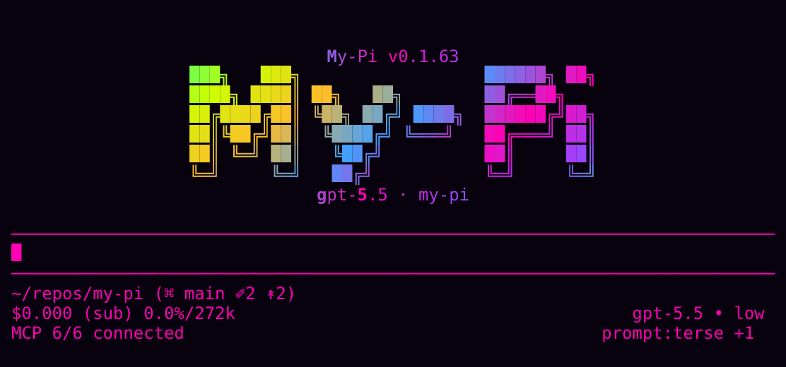

# my-pi

[](https://github.com/spences10/my-pi/actions/workflows/semgrep.yml)
[](https://viteplus.dev)
[](https://vitest.dev)

My curated [Pi](https://pi.dev) distribution: a ready-to-run
coding-agent CLI with MCP, LSP, skills, recall, redaction, telemetry,
team mode, prompt presets, and other handy extensions prewired.



Built on the
[@earendil-works/pi-coding-agent](https://github.com/badlogic/pi-mono)
SDK. Use the full distribution directly, or install individual
`@spences10/pi-*` packages into your own Pi setup.

## Quick start

```bash
pnpx my-pi@latest
# or: npx my-pi@latest / bunx my-pi@latest
```

## Two ways to use my-pi

### 1. Run the full distribution

Use `my-pi` if you want the complete, opinionated setup:

```bash
pnpx my-pi@latest
```

This is its own CLI wrapper around Pi. Do not install the root package
with `pi install npm:my-pi`.

### 2. Install individual Pi packages

Most extensions in this repo are also published as normal Pi packages:

```bash
pi install npm:@spences10/pi-lsp
pi install npm:@spences10/pi-mcp
pi install npm:@spences10/pi-redact
```

Use this path if you already have your own Pi setup and only want
selected features. Package READMEs are the source of truth for install
instructions, commands, configuration, and runtime behavior.

## What you get

- **Pi-native CLI + SDK wrapper** — interactive TUI, print mode, JSON
  mode, RPC mode, and programmatic runtime creation.
- **Project-aware MCP tools** — stdio and HTTP/streamable-HTTP servers
  from `mcp.json`, scoped so sensitive or noisy tools only load for
  the projects and orgs where they belong.
- **Project-aware skills** — discover, enable, disable, import, and
  sync Pi-native skills, with different skill sets per project.
- **LSP tools** — diagnostics, hover, definitions, references, and
  document symbols via language servers.
- **Context sidecar** — local SQLite storage for oversized tool
  output, keeping long results searchable without flooding chat
  context.
- **Guardrails** — Svelte and coding-preference checks that block
  configured anti-patterns before agents write them.
- **Prompt presets** — base presets plus additive prompt layers with
  per-project persistence.
- **Secret safety** — redaction plus reminders to use secret-safe
  environment loading.
- **Recall and telemetry** — local support for prior-session lookup,
  evals, latency analysis, and operational debugging.
- **Git UI** — interactive source-control staging and commit support.
- **Team mode** — local RPC teammate orchestration with tasks and
  mailboxes.
- **Themes and TUI helpers** — visual polish and shared modal
  primitives.

## Requirements

- Node.js `>=24.15.0`
- pnpm 11 for local development
- Pi authentication via `pi auth`, provider environment variables, or
  supported OAuth flows

`my-pi` uses native `node:sqlite` through context and telemetry
packages. The CLI suppresses Node's expected `node:sqlite`
`ExperimentalWarning`; standalone package/API consumers own their
process warning policy until Node marks it stable.

## Common usage

```bash
# full TUI
pnpx my-pi@latest

# one-shot print mode
pnpx my-pi@latest "summarize this repo"
pnpx my-pi@latest -P "explicit print mode"

# NDJSON events for scripts/agents
pnpx my-pi@latest --json "list all TODO comments"

# RPC mode for team/agent orchestration
pnpx my-pi@latest --mode rpc
```

Pi handles model authentication natively. For provider-specific model
examples, see the Pi docs and the relevant extension/package README.

## Reusable Pi packages

Install the full distribution with `pnpx my-pi@latest`, or install
selected extensions into vanilla Pi:

```bash
# Bash/Zsh/Fish
pi install npm:@spences10/pi-{context,lsp,team-mode}
```

Full package list here:

| Package                                                                            | Purpose                                                    |
| ---------------------------------------------------------------------------------- | ---------------------------------------------------------- |
| [`@spences10/pi-coding-preferences`](./packages/pi-coding-preferences/README.md)   | Configurable coding-workflow guardrails                    |
| [`@spences10/pi-confirm-destructive`](./packages/pi-confirm-destructive/README.md) | Destructive action confirmations                           |
| [`@spences10/pi-context`](./packages/pi-context/README.md)                         | Scoped SQLite FTS overflow cache for oversized tool output |
| [`@spences10/pi-git-ui`](./packages/pi-git-ui/README.md)                           | Interactive source-control staging UI                      |
| [`@spences10/pi-lsp`](./packages/pi-lsp/README.md)                                 | LSP-backed diagnostics and symbol tools                    |
| [`@spences10/pi-mcp`](./packages/pi-mcp/README.md)                                 | MCP server integration and `/mcp`                          |
| [`@spences10/pi-nopeek`](./packages/pi-nopeek/README.md)                           | `nopeek` reminder for secret-safe environment loading      |
| [`@spences10/pi-omnisearch`](./packages/pi-omnisearch/README.md)                   | `mcp-omnisearch` reminder for verified web research        |
| [`@spences10/pi-recall`](./packages/pi-recall/README.md)                           | `pirecall` reminder and background sync                    |
| [`@spences10/pi-redact`](./packages/pi-redact/README.md)                           | Output redaction and `/redact-stats`                       |
| [`@spences10/pi-skills`](./packages/pi-skills/README.md)                           | Skill management, import, and sync                         |
| [`@spences10/pi-sqlite-tools`](./packages/pi-sqlite-tools/README.md)               | `mcp-sqlite-tools` reminder for safer SQLite database work |
| [`@spences10/pi-svelte-guardrails`](./packages/pi-svelte-guardrails/README.md)     | Svelte pattern guardrails                                  |
| [`@spences10/pi-team-mode`](./packages/pi-team-mode/README.md)                     | Local team mode with RPC teammates, tasks, and mailboxes   |
| [`@spences10/pi-telemetry`](./packages/pi-telemetry/README.md)                     | Local SQLite telemetry and `/telemetry`                    |
| [`@spences10/pi-themes`](./packages/pi-themes/README.md)                           | Bundled theme pack for Pi                                  |

Shared helper packages such as `@spences10/pi-child-env`,
`@spences10/pi-project-trust`, `@spences10/pi-settings`, and
`@spences10/pi-tui-modal` are published as dependencies and are not
packages to install via `pi install`.

## Project structure

```text
apps/
  web/                     Landing page for discovering my-pi and its packages
src/
  index.ts                 CLI entry point
  api.ts                   Programmatic API
  extensions/              Root-only built-ins and distro wiring
packages/
  pi-*/                    Reusable Pi packages and shared support packages
.pi/
  presets.json             Optional project prompt presets
  presets/*.md             Optional project prompt preset files
mcp.json                   Project MCP server config
```
